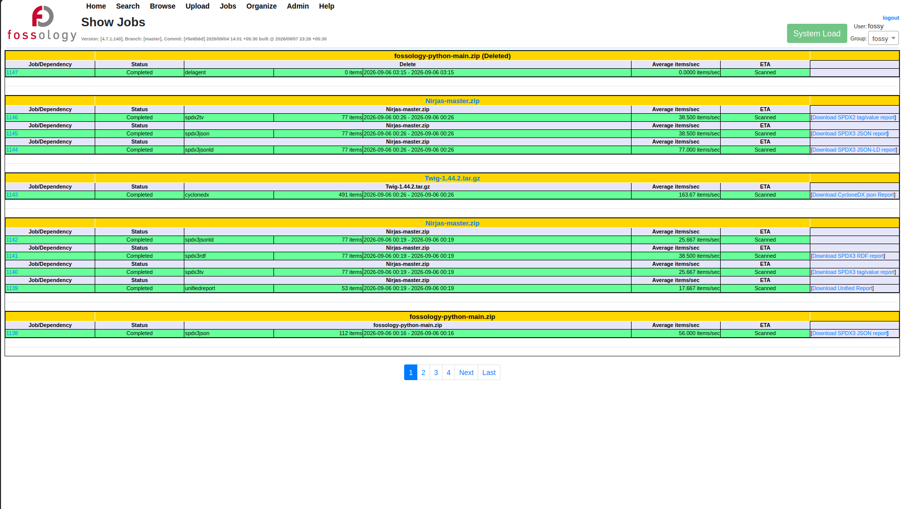
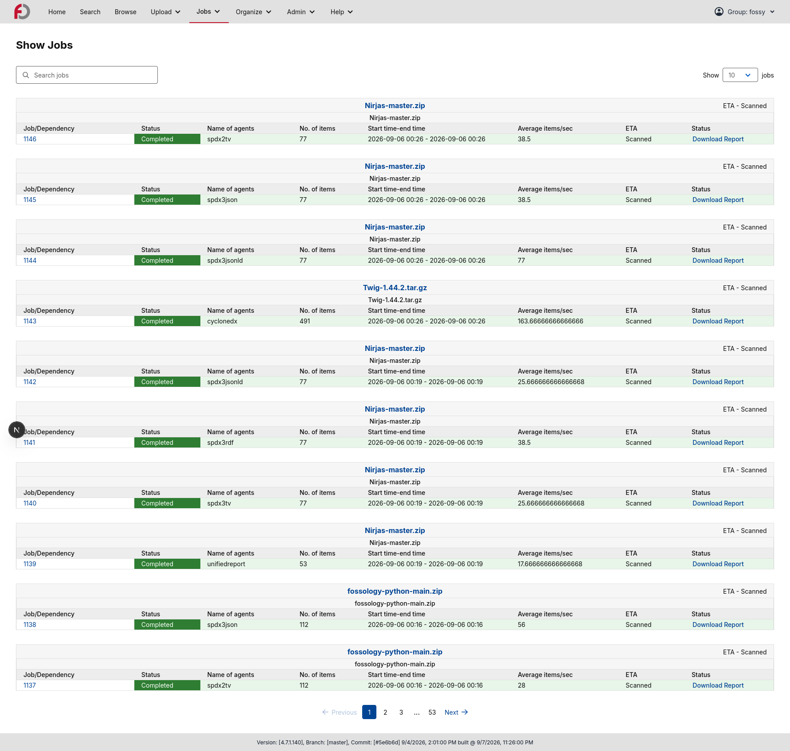
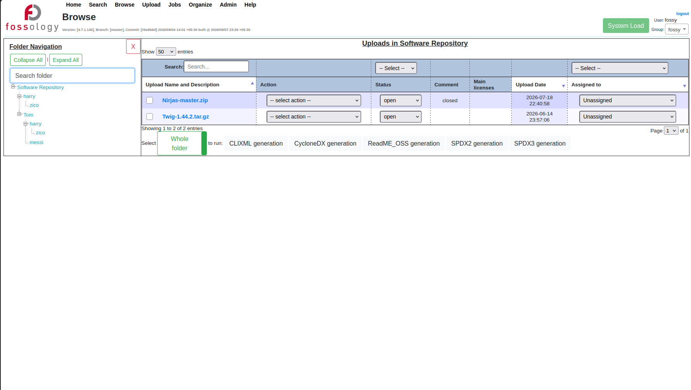
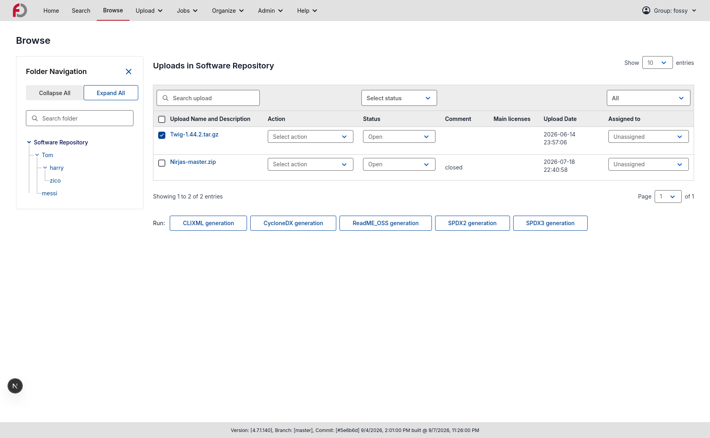
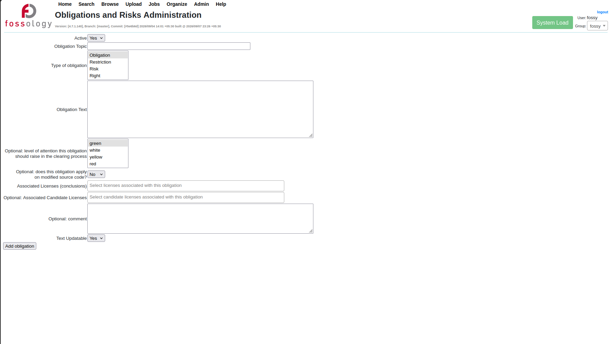
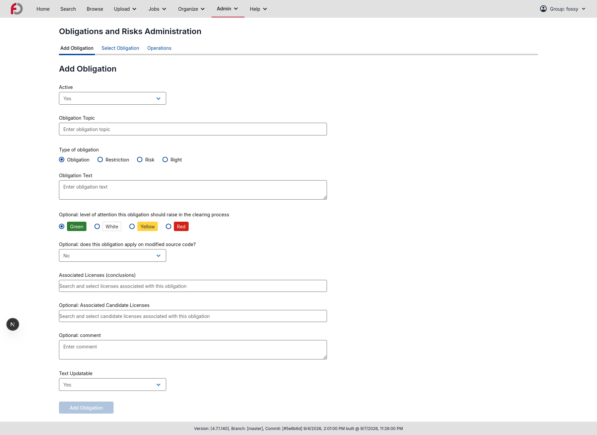

# GSoC2026

## *Completion of FOSSology UI Rewrite using Next.js @ [FOSSology](https://www.fossology.org/)*

# Project Details 

## What's the project about?

The **Completion of FOSSology UI Rewrite using Next.js** project focuses on completing and preparing the ongoing modernization of the FOSSology web interface for production use. Building on the previous GSoC work, the project focuses on completing the Next.js rewrite and aligning the frontend with FOSSology REST API v2. It also focuses on implementing the remaining UI pages and incorporating the redesigned interface developed through the [FOSSology UX and UI Redesign](https://github.com/fossology/fossology/discussions/2908#discussioncomment-11912320) project.

The project also focuses on establishing a consistent and scalable frontend architecture using **Next.js, TypeScript, Tailwind CSS, and shadcn/ui**, with reusable components and a structured design system. Alongside implementing the redesigned pages, the work includes refactoring existing components and API integrations, improving consistency and accessibility, and documenting reusable components through **Storybook**.

The overall goal is to provide FOSSology with a **modern, maintainable, and production-ready frontend** that preserves existing functionality while offering a more consistent and intuitive user experience. The project also aims to make the codebase easier to maintain and extend, providing a stronger foundation for future contributors and UI improvements.
  
# Contributions 

### My work was focused on the [FOSSologyUI](https://github.com/fossology/FOSSologyUI) repository

## 1. Completion of Remaining FOSSology UI Pages

The primary focus of this GSoC project was to continue the Next.js rewrite and complete the remaining pages of the FOSSology UI. The pages were implemented using the redesigned UI structure while preserving the existing functionality and integrating them with the updated frontend architecture.

### Upload Pages

Implemented the remaining **Upload pages**, covering different ways of adding and analyzing software in FOSSology:

- **Upload from Server**
- **Upload from URL**
- **Upload from VCS**
- **Import FOSSology Dump**
- **Import Report**
- **One-Shot Copyright/Email/URL Analysis**
- **One-Shot Monk Analysis**
- **One-Shot Nomos Analysis**

These pages were integrated with the required REST API v2 endpoints and common UI components to maintain consistent behaviour across the Upload section.

📌 Issue: [Implementation of the Upload Pages](https://github.com/fossology/FOSSologyUI/issues/396)

📌 Issue: [Implementation of the Upload Pages - Import Fossology Dump Page](https://github.com/fossology/FOSSologyUI/issues/409)

### Admin Pages

Completed the remaining **Admin pages** and their associated operations:

- **License Administration**
- **License Compatibility Rules**
- **Group Management**
- **Standard License Comments**
- **Acknowledgements**
- **Maintenance**
- **Scheduler**
- **Obligation Administration**
- **Tag**
- **Users**
- **Buckets**
- **Fossdash**
- **Customize**

The pages include their respective forms, tables, actions, imports/exports, and management operations wherever supported by the available API endpoints.

📌 Issue: [Implementation of the Admin Pages - Stage 1](https://github.com/fossology/FOSSologyUI/issues/401)

📌 Issue: [Implementation of the Admin Pages - Stage 2](https://github.com/fossology/FOSSologyUI/issues/402)

📌 Issue: [Implementation of the Admin Pages - Stage 3](https://github.com/fossology/FOSSologyUI/issues/406)

📌 Issue: [Implementation of the Admin Pages - Group Pages](https://github.com/fossology/FOSSologyUI/issues/398)

📌 Issue: [Implementation of the Admin Pages - Fossdash Page](https://github.com/fossology/FOSSologyUI/issues/407)

📌 Issue: [Implementation of the Admin Pages - Customize Page](https://github.com/fossology/FOSSologyUI/issues/408)

### Organize Pages

Implemented the Organize section, including:

- **Folders**
- **Uploads**
- **Licenses**

The Folder and Upload management pages were also integrated with the corresponding navigation and API functionality.

📌 Issue: [Implementation of the Organize Pages - Stage 1](https://github.com/fossology/FOSSologyUI/issues/397)

📌 Issue: [Implementation of the Organize Pages - Stage 2](https://github.com/fossology/FOSSologyUI/issues/400)

### Jobs Pages

Completed the Jobs section with:

- **My Recent Jobs**
- **All Recent Jobs**
- **Schedule Agents**

The pages were connected to the required API operations and updated to follow the redesigned UI and reusable component structure.

📌 Issue: [Implementation of the Jobs Pages](https://github.com/fossology/FOSSologyUI/issues/403)

### Browse Pages

Implemented the main **Browse screen** and continued the implementation of the pages available within **Browse Uploads**.

Completed pages include:

- **License Browser**
- **License View**
- **Report Configuration**
- **Export Lists**

The following Browse Upload pages are currently in progress:

- **Software Heritage**
- **File Browser**
- **Spasht Browser**
- **Keyword Browser**
- **Email/URL/Author Browser**
- **Copyright/ECC/IPRA**
- **View**

The Browse section involved more complex data presentation and navigation requirements, so these pages required additional API integration and UI work.

📌 Issue: [Implementation of the Browse Pages - Stage 1](https://github.com/fossology/FOSSologyUI/issues/410)

📌 Issue: [Implementation of the Browse Pages - Stage 2](https://github.com/fossology/FOSSologyUI/issues/411)

📌 Issue: [Implementation of the Browse Pages - Stage 3](https://github.com/fossology/FOSSologyUI/issues/412)

📌 Issue: [Implementation of the Browse Pages - Export Lists Pages](https://github.com/fossology/FOSSologyUI/issues/404)

## 2. REST API v2 Integration

Integrated the implemented pages with the **FOSSology REST API v2**, replacing remaining usage of the older API implementation.

- Wired the required **REST API v2 endpoints** for Upload, Admin, Organize, Jobs, and Browse functionality
- Updated API handling to match the current v2 request and response structures.
- Improved parameter handling and data transformation between the API and UI.
- Identified functionality that requires new or updated backend endpoints and documented these as feature enhancement issues where necessary.
- Refactored API integration code to reduce duplication and make it easier to maintain across pages.

## 3. Component Refactoring and Implementation

Refactored the existing components and introduced new reusable components to create a more consistent and maintainable UI.

- Refactored repeated form, table, navigation, search, selection, and action patterns.
- Introduced reusable components such as **Folder Navigation, BrowseUploads Breadcrumbs, Jobs Table**, and reusable UI variants.
- Added custom component variants where the existing shadcn/ui components did not fully meet the FOSSology design requirements, such as **Searchable Multi Select, Pagination Control, Modal**.
- Improved the overall component structure to make future page implementation and maintenance easier.

This helped reduce code duplication and provided a common foundation for the remaining pages of the Next.js rewrite.

📌 Pull Request: [Code refactor and alignment for UI Consistency](https://github.com/fossology/FOSSologyUI/pull/426)

## 4. Storybook Component Documentation

Documented the reusable UI components through Storybook to make the component library easier to understand and reuse.

- Added stories for reusable UI components and their supported variants.
- Documented different component states and usage patterns.
- Used Storybook as a reference while developing and refactoring shared components.
- Improved the discoverability of reusable components for future contributors.

## 5. UI Redesign Implementation and Consistency

Continued implementing the UI based on the redesigned FOSSology interface developed through the [FOSSology UX and UI Redesign](https://github.com/fossology/fossology/discussions/2908#discussioncomment-11912320) project.

- Applied Tailwind CSS and shadcn/ui components throughout the implemented pages.
- Maintained consistent spacing, typography, colours, forms, tables, buttons, dialogs, and navigation patterns.
- Reused the shared design components wherever possible instead of introducing page-specific UI implementations.
- Worked closely with the existing design direction to ensure that newly implemented pages remain visually consistent with the redesigned sections of FOSSologyUI.

## 6. Codebase Refactoring and Issue Resolution

Alongside page implementation, several parts of the codebase were refactored to improve maintainability and resolve issues encountered during development.

- Refactored existing page implementations and resolved issues identified during development, testing, and mentor reviews.
- Improved API response and error handling across the implemented pages.
- Fixed UI and functional issues discovered during integration and review.
- Continued codebase cleanup and structural improvements as new pages and components were introduced.

## 7. Before vs After – Completion of the Next.js Rewrite

The FOSSology UI at the beginning of this project had several pages that were still incomplete or required further work as part of the ongoing Next.js rewrite. Different sections also used separate implementations and lacked consistent reusable patterns.

With the work completed during this project:

- Upload, Admin, Organize, and Jobs pages completed, with Browse pages implemented or progressed significantly
- Existing functionality integrated with REST API v2
- Common UI patterns converted into reusable components
- Navigation and page layouts redesigned for a more consistent user experience
- Next.js frontend became easier to maintain and extend

The work builds on the foundation established during the previous GSoC project and brings the FOSSology UI closer to a complete, maintainable, and production-ready Next.js frontend.

### Examples of the old PHP UI vs the new Next.js UI

#### Example 1: Show Jobs Page

- **Before:** The older PHP UI used a traditional layout with limited visual consistency and less structured presentation of job information.

  

- **After:** The new Next.js implementation provides a cleaner layout with improved spacing, typography, tables, and action controls. The page follows the redesigned UI system and uses reusable components for a consistent experience.

  
  

### Example 2: Browse Page with Folder Navigation

- **Before:** The older PHP UI provided the Browse functionality through a traditional layout, with folder and upload navigation integrated into the page.

  

- **After:** The new Browse page provides a cleaner and more structured interface for exploring the software repository. It also features the reusable Folder Navigation component, which makes it easier to navigate through folders and uploads while keeping the navigation experience consistent across the UI.

  

### Example 3: Obligation and Risk Management Page with Tabs Navigation

- **Before:** The older PHP UI handled the different Obligation and Risk Management operations through separate pages and navigation paths. Users had to move between different pages to access actions such as adding, selecting, importing, and managing obligations.

  

- **After:** The new Obligation and Risk Management page brings related operations into one interface; reusable Tabs Navigation organizes actions into tabs, keeping all the available operations within easy reach of the user and simplifying navigation.

  

These examples demonstrate how the Next.js rewrite goes beyond migrating existing functionality. The new UI introduces reusable components, consistent design patterns, and a more structured interface while retaining the functionality of the existing FOSSology application.

# Deliverables 
|                               Tasks                               | Planned |       Completed      |
| :---------------------------------------------------------------: | :-----: | :------------------: |
| Completion of Remaining UI Pages |   Yes   | :heavy\_check\_mark: |
|         REST API v2 Integration and Alignment         |   Yes   | :heavy\_check\_mark: |
|                 UI/UX Restructuring using Tailwind CSS and shadcn/ui                 |   Yes   | :heavy\_check\_mark: |
|    Reusable Component Architecture and Refactoring    |   Yes   | :heavy\_check\_mark: |
|            Storybook Component Documentation            |   Yes   | :heavy\_check\_mark: |
|            Next.js Architecture and Modular Code Structure            | Yes   | :heavy\_check\_mark: |
|                    Bug Fixes & Issue Resolution                   |   Yes   | :heavy\_check\_mark: |
|                    Testing and Validation                    |   Yes    | In Progress |
|                  Developer Documentation                  |   Yes   | :heavy\_check\_mark: |

The major page implementation work across **Upload, Admin, Organize, Jobs, and Browse** has been completed, with a few complex Browse Upload pages still in progress. REST API v2 integration, reusable component development, UI restructuring, and Storybook documentation have also been completed as part of the project.

The remaining work primarily involves completing the in-progress Browse functionality, and continued testing and validation.

# Future Plans 

1. Complete the remaining Browse Upload pages.
2. Continue improving and validating the REST API v2 integration, especially for functionality that depends on new or updated backend endpoints.
3. Continue maintaining and expanding the reusable component library as new UI requirements are introduced.
4. Improve test coverage and carry out further UI and functional testing across the completed pages to ensure consistency and reliability.
5. Continue contributing to FOSSologyUI after GSoC by addressing issues, improving existing pages, and helping complete the remaining parts of the Next.js rewrite.

# Things I learned from Google Summer of Code 

- Gained practical experience in working with and maintaining a **large-scale Next.js codebase**, understanding an existing architecture and extending it without disrupting existing functionality.

- Strengthened my understanding of **REST API integration**, especially working with API v2 request and response structures and handling differences between frontend requirements and available backend functionality.

- Learned how to identify repeated patterns across pages and turn them into **reusable components**, improving consistency and reducing code duplication.

- Improved my understanding of **component-driven development** through the implementation and documentation of reusable components with **Storybook**.

- Learned how to translate a shared **Figma-based design system** into a functional interface using Tailwind CSS and shadcn/ui while maintaining consistency across different sections of the application.

- Improved my ability to work with **complex UI flows**, including navigation, forms, tables, search, pagination, tabs, folder navigation, imports, exports, and multi-step operations.

- Gained experience in **refactoring existing codebases**, resolving issues across the UI and API integration, and making improvements without affecting existing functionality.

- Improved my understanding of the **open-source development workflow**, including issue tracking, pull requests, code reviews, discussions, and incorporating feedback from mentors and contributors.

- Learned how to break a large project into **smaller and manageable milestones**, prioritize tasks based on complexity and dependencies, and adjust plans when implementation or API limitations required additional work.

- Strengthened my **communication, collaboration, problem-solving, and time management skills** through regular interaction with mentors, contributors, and the UX/UI designer.

Overall, GSoC gave me the opportunity to work on a real-world open-source project at a much larger scale than a typical individual project. It helped me become more comfortable with understanding existing systems, making changes without disrupting functionality, collaborating through reviews, and thinking about maintainability alongside implementation.
